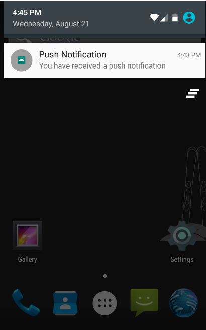

# Android Push Notification Using Firebase
Firebase Cloud Messaging Android client app, use the<a href="https://firebase.google.com/docs/android/setup"> FirebaseMessaging</a> API.

# Requirements:

FCM clients require devices running Android 4.1 or higher that also have the Google Play Store app installed, or an emulator running Android 4.1 with Google APIs. Note that you are not limited to deploying your Android apps through Google Play Store.

1. Android Studio 3.4
2. If you haven't already, <a href="https://firebase.google.com/docs/android/setup">add Firebase to your Android project</a>
3. Set up Firebase and the FCM SDK

In your project-level build.gradle file, make sure to include Google's Maven repository in both your buildscript and allprojects sections.
<pre>buildscript {
   ...
   dependencies {
       classpath 'com.android.tools.build:gradle:3.4.1'
       classpath 'com.google.gms:google-services:4.2.0'
       // NOTE: Do not place your application dependencies here; they belong
       // in the individual module build.gradle files
   }
}
...
</pre>

Add the dependency for the Cloud Messaging Android library to your module (app-level) Gradle file (usually app/build.gradle)
<pre>dependencies {
  ....
   implementation 'com.google.firebase:firebase-core:17.0.1'
   implementation 'com.google.firebase:firebase-messaging:19.0.1'
}</pre>

# Notifications Overview:
A notification is a message that Android displays outside your app’s UI to provide the user with reminders, communication from other people, or other timely information from your app. Users can tap the notification to open your app or take an action directly from the notification.

# Note:
creating notification channel if android version is greater than or equals to oreo

# Output:
